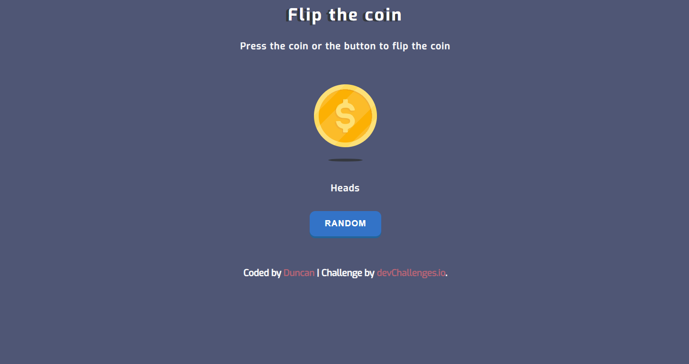

<h1 align="center">Flip The Coin | devChallenges</h1>

   Solution for a challenge <a href="https://devchallenges.io/challenge/flip-the-coin" target="_blank">Flip The Coin</a> from <a href="http://devchallenges.io" target="_blank">devChallenges.io</a>.

  <h3>
    <a href="https://duncan-122512.github.io/Flip-The-Coin/">
      Demo
    </a>
     | 
    <a href="https://github.com/Duncan-122512/Flip-The-Coin/tree/main">
      Solution
    </a>
     | 
    <a href="https://devchallenges.io/challenge/flip-the-coin">
      Challenge
    </a>
  </h3>

<!-- TABLE OF CONTENTS -->

## Table of Contents

- [Overview](#overview)
  - [What I learned](#what-i-learned)
- [Built with](#built-with)

<!-- OVERVIEW -->

## Overview

How it works:

- The coin flips upward, rotating between heads and tails
- Its shadow shrinks as it rises and expands again as it falls back down
- The final result (heads or tails) fades in once the animation ends

Interaction behavior:

- During the animation, the coin and “RANDOM” button are temporarily disabled and partially faded to - prevent interruption
- Once the flip is complete, both controls are re-enabled and ready for the next toss

### What I learned

- Manipulated the DOM using JavaScript with a strong focus on building accessible, user-friendly interactions
- Designed responsive layouts with fluid typography to ensure a consistent experience across devices

### Built with

- HTML5
- CSS3
- Flexbox
- Vanilla JavaScript

## Author

- GitHub [Duncan-122512](https://github.com/Duncan-122512)
